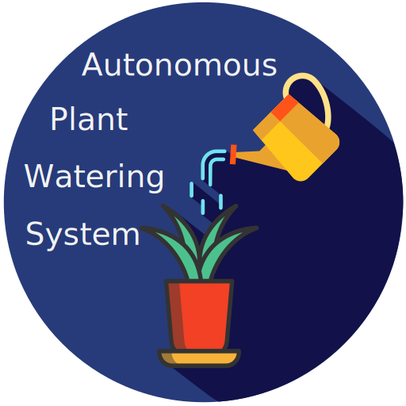
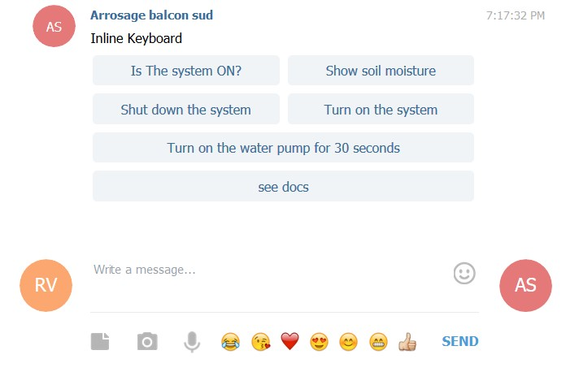
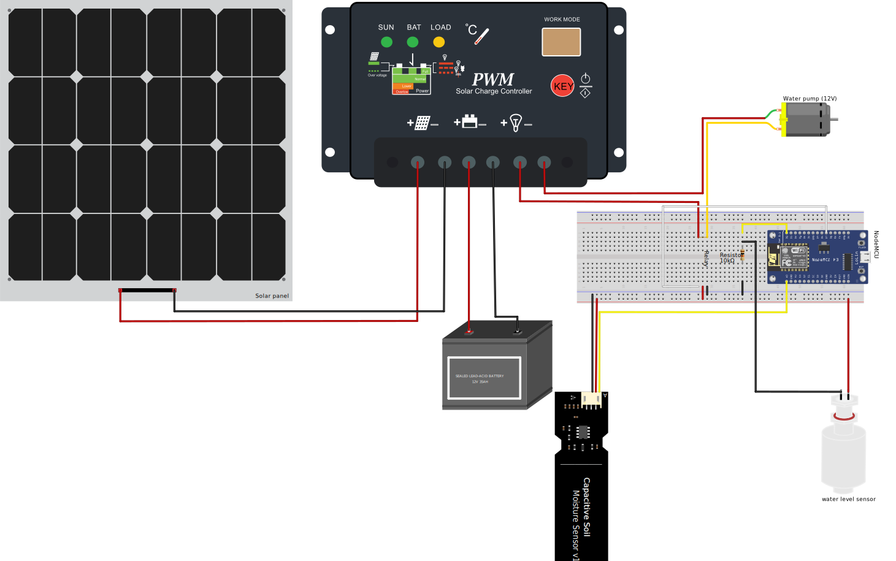

# 🌊🌳 Autonomous plant watering system 

## Introduction

This project presents a smart autonomous plant watering system. The system is autonomous in energy using a 12v battery and a solar panel, and water the plant when the right conditions are all set, with a well thought (I hope) fail-proof system. It is smart because it communicates with the user(s) through the Telegram app.

The steps followed by the system are as follows:
- the soil water content is always monitored;
- if the soil water content is below a certain value (`max_soil_moisture`), the system:
  * (🔔) checks the water tank is not empty (and during) the watering event to avoid any damage to the pump running dry;
  * (🔔) checks the minimum water period between two watering events is exceeded. This is done to avoid watering the plants too many times during the day (better have a little dryness at some point), and to add some safety in case the soil moisture sensor is broken;
  * (🔔) start the irrigation ;
  * stops the irrigation whenever:
    + (🔔) the soil water content reaches a certain value (`max_soil_moisture`) or;
    + (🔔) the water tank is empty, in which case irrigation will resume as soon as it is filled again, or;
    + (🔔) the watering duration exceeds the maximum duration allowed for each watering event (`watering_max_time`). The aim here is to avoid running the pump until the water tank is empty if there is a leak in the system that would prevent the soil moisture to increase;
- (🔔) checks that plants are watered at least every given period of time (`max_wo_water`), to avoid them to die if e.g. the soil moisture sensor is broken and return always high values ;

The user is notified by Telegram messages at every important step (denoted 🔔). The user can also trigger manually an irrigation event from Telegram, even if the soil water content is higher than the given value (`max_soil_moisture`). It is also possible to turn the whole system ON and OFF, ask if the system is up and running, or ask the current value of the soil water content.



> When you go out for vacations, simply add a friend to the Telegram group so they know when to visit your house to fill up the water tank! 

## Set up yours

To reproduce this project, you'll need some tools, some material, and the code from this project.

### Code

To get the code from this project, either clone it (or better, fork it) using GIT, and if you don't know what GIT, clone and fork means, simply download it on your computer using [this link](https://github.com/VEZY/Plant_watering/archive/master.zip) 😺.

Then, configure it to your needs !

To use Telegram, the NodeMCU needs to be connected to the internet. I did it using its WIFI module and my home WIFI.
To configure your own connection, open the `plant_watering.ino` script in Arduino IDE, and fill-in the missing values for your wifi credentials (I'm assuming you have WiFi):

```c
String ssid  = "xxxxx"; // Name of your Wifi
String pass  = "xxxxx"; // Wifi Password
```

Then, we'll set up a Telegram bot, which is an user account a little like you have, but actually run by a robot (your NodeMCU). To do so, follow the steps described [here](https://core.telegram.org/bots#6-botfather). In few words:
- Open Telegram (and connect with your account);
- Create a new bot:
 * Search `BotFather` in your contacts (type it in the search bar), and open a conversation with it (as you'd do with any new contact);
 * Type `/newbot` in the conversation (watch for the case and include the `/`!)
 * Name your bot as you want, but end it with "bot" (e.g. "watering_balcony_bot");
 * `Botfather` gives you a bot token, keep it very secret (don't share it using GIT!!), we'll use it in few steps;
 * Search it in your contacts, and send it this message: `/start`
 * Copy the token returned by `Botfather` and paste it on your `plant_watering.ino` script here:
```c
String token = "xxxxxx:xxxxxxxxxxxxxxxxxxxxxxx"; // Telegram bot token
```

Your bot is now alive !

To give it the ability to communicate with you, it needs to know your conversation ID. Because we want to be able to share what the bot is saying with other people in case we go out in vacation, I prefer to create a group chat instead. So create one (`New Group`), add your bot by searching its name, and add a third bot named `IDBot` temporarily. Then name your group chat as you want.
Open your group chat, and type `/getgroupid`. IDBot will return a number such as -xxxxxxxxx (don't forget the minus when you copy it!), that's your group chat ID!
> you can also ask `/getid` to get your personal ID, so your bot will send messages directly to you instead (not sending it to the group)

Copy the ID, and paste it on your `plant_watering.ino` script here:
```c
int chatID = -000000000; // This the ID of your group chat
```
> Paste the `/getid` here instead if you want the bot to send messages directly to you

Then, remove IDBot from your group just in case (we don't want any data leaked).

For the last step, you'll need to install the `CTBot` and `ArduinoJson` libraries. To do so, type `ctrl+maj+I`, search `CTBot`, and search for `CTBot by Stefano Ledda`, and click install. Then repeat for `ArduinoJson`, and search for `ArduinoJson by Benoit Blanchon`, but install the version 5.13.5 for now because `CTBot` is not compatible with the sixth version yet (you can check [here](https://github.com/shurillu/CTBot) if there are any changes).

And that's it, your code is ready !
Now you can upload it to the NodeMCU! If there are some errors, check that you selected NodeMCU 1.0 as the board type, and that you use the right version for your libraries.

### Tools

The tools are very simple, I used for this project:
- A soldering iron + tin (e.g. 220V 60W);
- A multimeter (mine is a TackLife DM01M);
- A flat screwdriver (tiny is better);
- Cutting pliers;

If you have them you can also add some wire strippers, but they are not indispensable.

### Material

Here is a list of the products used to build the system. I must say that I don't receive any incentives from Amazon, from which all products were bought.

To control the system:
- [NodeMCU board (ESP8266)](https://www.amazon.fr/gp/product/B0754HWZSQ/ref=ppx_od_dt_b_asin_title_s02?ie=UTF8&psc=1) for the brain, 17.99€
- [Relay module](https://www.amazon.fr/gp/product/B07GRW83FR/ref=ppx_od_dt_b_asin_title_s02?ie=UTF8&psc=1), 11.99€
- [120 prototyping jumper wires](https://www.amazon.fr/gp/product/B01JD5WCG2/ref=ppx_yo_dt_b_asin_title_o05_s00?ie=UTF8&psc=1), 6.99€  -> prototyping
- [3 breadboards](https://www.amazon.fr/gp/product/B06XKZYFYN/ref=ppx_yo_dt_b_asin_title_o05_s00?ie=UTF8&psc=1), 8.99€ -> prototyping
- [Waterproof box](https://www.amazon.fr/gp/product/B00HW0OMKU/ref=ppx_yo_dt_b_asin_title_o05_s00?ie=UTF8&psc=1), 10.99€
- [525 pieces resistors kit](https://www.amazon.fr/gp/product/B071LHFQKD/ref=ppx_yo_dt_b_asin_title_o03_s01?ie=UTF8&psc=1), 10.99€
- [Printed PCB](https://www.amazon.fr/gp/product/B07G5CRQXK/ref=ppx_yo_dt_b_asin_title_o02_s00?ie=UTF8&th=1) with connections similar to a breadboard, 9.27€
- [Electrical stranded wires 20, 22 or 24 AWG](https://www.amazon.fr/gp/product/B07G72DRKC/ref=ppx_yo_dt_b_asin_title_o01_s00?ie=UTF8&th=1) depending on your preference (20 is more solid but need to be reduced for some connections, 22 is good, 24 is cheaper), 18.99€

For the autonomy in energy:
- [12V Battery](https://www.amazon.fr/gp/product/B009D0KFOO/ref=ppx_yo_dt_b_asin_title_o06_s00?ie=UTF8&psc=1), 21.90€
- [10W wp 12V monocrystalline solar panel](https://www.amazon.fr/gp/product/B007HAZY8Y/ref=ppx_yo_dt_b_asin_title_o05_s02?ie=UTF8&psc=1), 23.90€
- [12/24V charge controller](https://www.amazon.fr/gp/product/B071ZZ2S84/ref=ppx_yo_dt_b_asin_title_o05_s02?ie=UTF8&psc=1), 13.99€

For the water tank:
- [12V water pump](https://www.amazon.fr/gp/product/B07NPN5XBS/ref=ppx_yo_dt_b_asin_title_o04_s00?ie=UTF8&psc=1), 16.99€
- [DC male/female connector](https://www.amazon.fr/gp/product/B07BPSCNSM/ref=ppx_yo_dt_b_asin_title_o03_s00?ie=UTF8&psc=1) (to connect the pump), 6.99€

The sensors:
- [Water level floater](https://www.amazon.fr/gp/product/B01MTYPK9I/ref=ppx_yo_dt_b_asin_title_o05_s02?ie=UTF8&psc=1), 7.99€
- [Capacitive soil moisture sensor](https://www.amazon.fr/gp/product/B07WCB3GCB/ref=ppx_od_dt_b_asin_title_s02?ie=UTF8&psc=1), 9.49€
- some nail polish for waterproofing the soil moisture sensor, 7.99€;

And the irrigation system:
- [Irrigation system](https://www.amazon.fr/gp/product/B07MSJSMXK/ref=ppx_yo_dt_b_asin_title_o05_s01?ie=UTF8&psc=1), 22.97€

For a total of 237.40€. That's not cheap!
But keep in mind that it's still cheaper than a pre-built system, and with a lot more capabilities! Also, some parts are only for prototyping (15.98€), and I purchased many components in groups of several pieces for other projects, e.g. 525 resistors is a crazy amount 🤪, you don't need 3 NodeMCU boards, nor 6 relays for this project.

### Assembly

You can find the assembly of the parts using [Fritzing](https://fritzing.org/home/) to open [the Fritzing project](Fritzing_project.fzz) in this repository. Here is a view of the whole schematic:



> NB: the NodeMCU is connected to the solar charge controller by a USB cable (the one in the schematic does not have one). See the [Material](#material) section for an example of a solar charge controller with a USB.

I made all custom parts available in the [fritzing](https://github.com/VEZY/Plant_watering/fritzing_parts) folder (all can be found on the internet except the water floater because I made it).

## Acknowledgements

I would like to acknowledge my wonderful partner that let me do this during the weekends! And of course all the makers that made the project possible, such as @shurillu for the super [`CTBot`](https://github.com/shurillu/CTBot) library, EstebanP27 for his [tutorial](https://www.instructables.com/id/Smart-Plant-Watering-Using-ThingSpeaks-and-Powered/) from which I learned a lot for this project! I would also like to thanks [svgrepo](https://www.svgrepo.com) from which I used SVGs as a basis for the logo.
